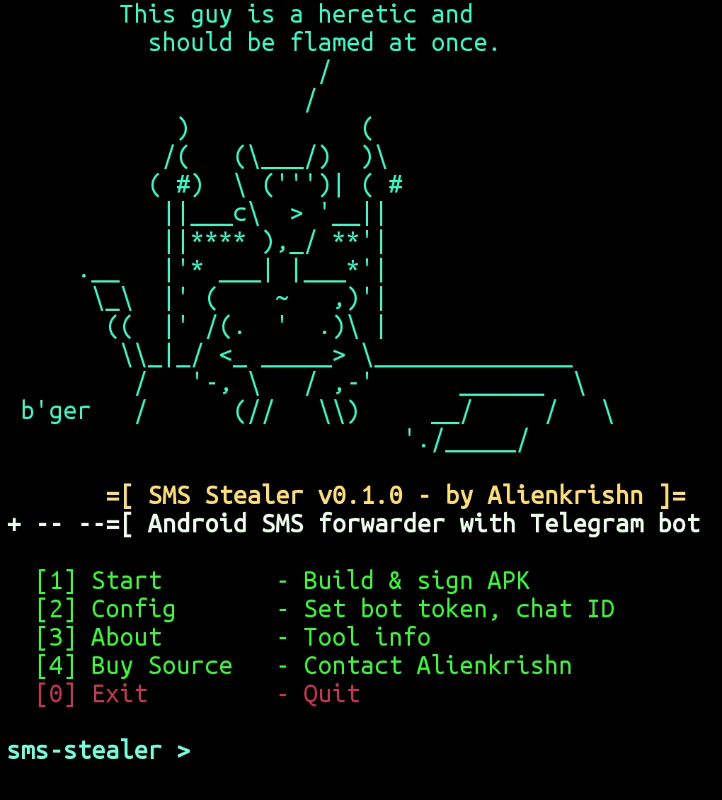

<div align="center">



# 📱 SMS Stealer

**Build a disguised Android WebView app that silently intercepts and forwards incoming SMS via Telegram.**

[](#-about)
[](#-about)
[](#-about)

<br>

</div>

---

## 📋 About

| Detail       | Info                                     |
|--------------|------------------------------------------|
| **Name**     | sms-stealer                              |
| **Language** | Ruby                                     |
| **Author**   | Alienkrishn [Anon4you]                   |
| **Version**  | 0.1.0                                    |

### Description
Builds an Android application packaged with a custom WebView and integrated with a Telegram bot. Once installed on a target device, it operates silently in the background, intercepting all incoming SMS messages and forwarding them directly to your Telegram chat.

> [!WARNING]
> **Disclaimer:** This tool was built for educational purposes only to demonstrate how these scams work. Do not use this tool for any illegal, unauthorized, or malicious activities. The author is **not responsible** for any misuse or damage caused by this program. Use it responsibly and only on devices you have explicit permission to test.

---

## 🚀 Usage

Clone the repo and run:

```bash
bash install_requirements.sh
```

This will install all requirements. After that, run the tool:

```bash
./sms-stealer.rb
```

---

> [!NOTE]
> The generated SMS stealer app is encrypted. You can buy the complete SMS-stealer app source code from me: 
> **Contact:** [https://t.me/alienkrishn](https://t.me/alienkrishn)

---

<div align="center">

**Author: Alienkrishn [Anon4you]**

</div>
